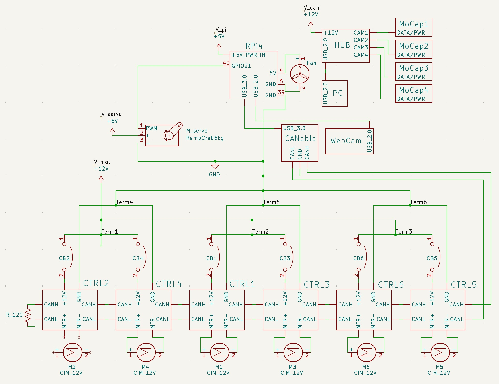

# Electrical Design

## System description
The trunk is actuated by 6 CIM 12V motors, each with a Talon SRX controller and an encoder. The CIM motors are powered by a 12V, 100A power supply. A 20A circuit breaker is in series with the positive terminal of each motor controller to protect from current spikes. Low level motor commands are handled with a Raspberry Pi 4, which has its own 5V power supply. CAN is the protocol used to communicate commands from the Raspberry Pi to the motor controllers, via a CANable 1.0 device. The gripper servo has its own 6V power supply. The grounds of all power supplies are connected to a common ground, which is connected to the frame. 

## Circuit diagram

