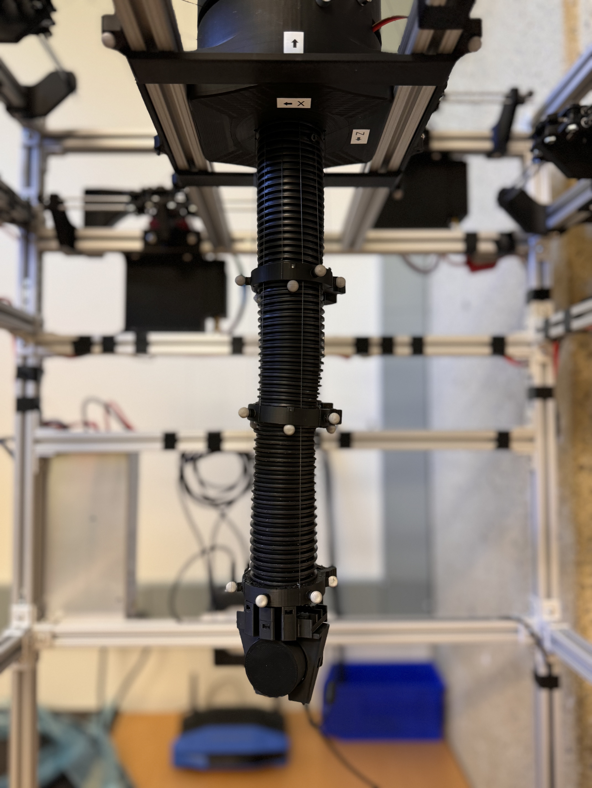

# Welcome to the ASL Trunk Robot documentation
This documentation provides a detailed guide to the setup, configuration, and use of the Trunk Robot. It is intended for internal use by the team involved in the development, deployment, and maintenance of the robot.

{ align=right width=40% }

## Contents
- **Design:** Documentation for full-system software, electrical, and mechanical design. Inlcudes BOM, CAD assets, circuit diagram, and design considerations.
- **Setup:** Instructions for setting up the hardware and software. This shall be referenced for repairs, upgrades, and new installations.
- **Usage:** Description on how to use the Trunk Robot, with details on each subcomponents and the overall data collection pipeline.
- **Contributing:** Guidelines for contributing to the development of the Trunk Robot project.
