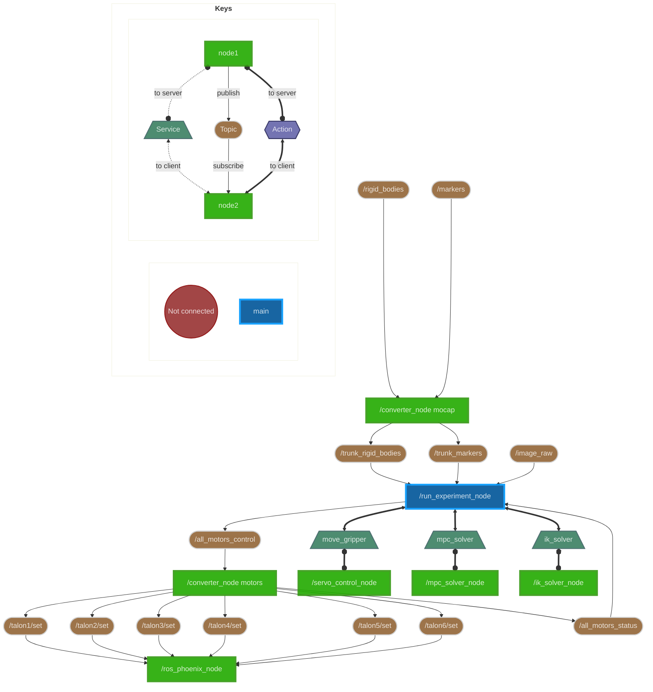

# Software Design

## Description
The software stack of the ASL Trunk Robot is primarily developed in ROS2, and can is divided into the components:
*main*, *motion capture*, *motor control*, *camera* and *gripper*.

We assume that several computing resources are available: a Rapsberry Pi for executing the motor control, a main linux machine for running the experiments, and a Windows machine for running the motion capture Motive software.

## ROS2 Graph
We provide an overall architecture of the ROS2 nodes, topics and services used in the software stack.
This diagram is inspired by [ros2_graph](https://github.com/kiwicampus/ros2_graph/).

## Teleoperation

### Overview
The trunk robot can be teleoperated by a user wearing an Apple Vision Pro. We designed an augmented reality app written in Swift which initializes a virtual 3D, 3-link spherical pendulum overlayed on the real-world view of the user. Once the virtual trunk is initialized, the user can calibrate the position and orientation of the virtual trunk to the hardware system. After calibration, the user can look at one of the disks on the trunk, which then lights up to denote its selection. The user can pinch their thumb and forefinger to select the disk, then the position of the virtual disk will mirror the position of their hand. The virtual disk positions can optionally be streamed over WiFi to a ROS2 listener, which publishes the 3D positions of the 3 disks on the trunk to the desired positions topic. A controller node subscribes to this topic and calculates the motor outputs necessary to attain that pose. The updated motor outputs are published to the motors, which causes the hardware trunk to mirror the virtual trunk. Streaming of desired trunk positions is done at 10Hz, and all of the other ROS2 functions run at 100Hz.

### Swift App Design
The Apple Vision Pro teleoperation app was written in Swift 5 using XCode 16 for VisionOS 2.1.

Our 3D assets were programmatically generated with standard hierarchical RealityKit Entities. The entities are placed into a *MeshResource.Skeleton*, upon which a custom IKComponent is added. A corresponding IKSolver smoothly solves the inverse kinematics of the 3 spherical pendulum joints when the position of the end effector is commanded with a gesture. The disk selection gestures are created with DragGestures. The streaming functionality for our app was heavily inspired by [VisionProTeleop](https://github.com/Improbable-AI/VisionProTeleop), using GRPC to stream disk positions over WiFi. 

Source code for the app can be found in this [GitHub repository](https://github.com/StanfordASL/trunk-teleop). 

